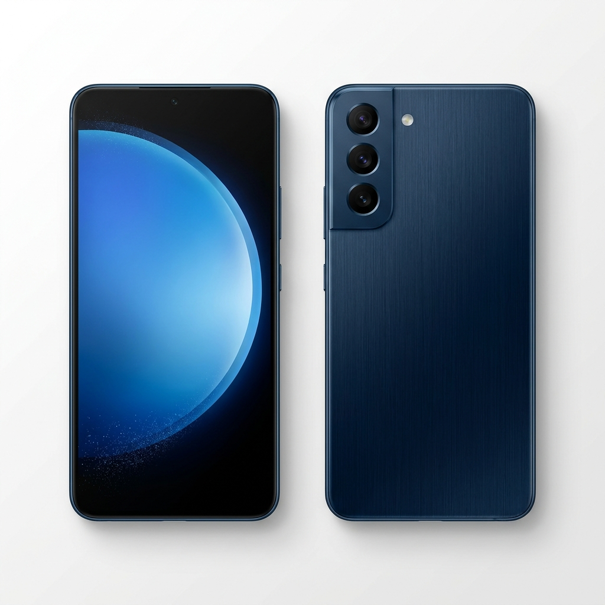

# PHANTOM Landing Page



A high-end, modern, and interactive landing page built for **PHANTOM**, a fictional next-generation smartphone. This project was developed as part of a technical assignment to demonstrate advanced UI/UX skills, modern frontend architecture, and performance optimization.

## ✨ Key Features

- **Modern Aesthetic:** Clean, premium design inspired by top-tier tech brands, utilizing custom CSS variables for spacing, typography (Inter), and colors.
- **Interactive 3D Hero:** A fully responsive Hero section featuring a mouse-tracking 3D parallax effect on the product display.
- **Dynamic Color Picker:** An interactive product showcase allowing users to switch between 4 device colorways (Phantom Black, Arctic Silver, Navy, Rose Gold), mapping directly to real product assets and dynamically changing the gradient background.
- **Scroll Animations:** Smooth, stagger-delayed fade-up animations in the Features section triggered via `IntersectionObserver`.
- **Dark Mode Support:** Built-in seamless dark mode integration controlled via a toggle in the glassmorphic navigation bar. Saves user preference to `localStorage`.
- **Performance & SEO:** Optimized for high PageSpeed Insights scores, complete with essential meta tags and Open Graph configurations.
- **Newsletter Integration:** A functional email signup form featuring client-side validation, loading states, and simulated webhook POST requests.

## 🛠️ Technologies Used

- **Framework:** [React 18](https://react.dev/)
- **Build Tool:** [Vite](https://vitejs.dev/)
- **Styling:** Vanilla CSS3 (Custom Properties, Flexbox, CSS Grid)
- **Icons & Assets:** Custom SVG geometry and optimized `.png` product assets.
- **Deployment:** Vercel / Netlify / GitHub Pages (Configured for easy CI/CD)

## 📂 Project Structure

```text
d:\test-helicorp\
├── public/                 # Static assets (Favicon, Open Graph image)
│   └── product/            # High-res product images (Black, Navy, Silver, Rose Gold)
├── src/
│   ├── components/         # Modular React components
│   │   ├── ColorPicker/    # Color variant selector & dynamic background
│   │   ├── FeaturesComponent/# Animated feature cards
│   │   ├── Footer/         # Responsive footer links
│   │   ├── Hero/           # 3D parallax hero section
│   │   ├── Navbar/         # Glassmorphic header & mobile menu
│   │   ├── Newsletter/     # Email capture form
│   │   └── TechSpecs/      # Technical specifications table
│   ├── App.jsx             # Main layout and Theme Provider
│   ├── index.css           # Global design system (Variables, Reset, Animations)
│   └── main.jsx            # React entry point
├── .env.example            # Environment variables template (Webhooks)
└── package.json            # Project dependencies
```

## 🚀 Getting Started

To run this project locally:

1. **Clone the repository:**
   ```bash
   git clone https://github.com/thdanhnguyen/test-helicorp.git
   cd test-helicorp
   ```

2. **Install dependencies:**
   ```bash
   npm install
   ```

3. **Environment Setup (Optional):**
   Copy `.env.example` to `.env.local` to enable webhook functionality for the Newsletter form.
   ```bash
   cp .env.example .env.local
   # Edit .env.local and set VITE_WEBHOOK_URL
   ```

4. **Run the development server:**
   ```bash
   npm run dev
   ```

5. **Build for production:**
   ```bash
   npm run build
   ```

## 📝 Author Note

This project strictly adheres to the requirements of the **Helicorp Frontend Web Developer** assignment. All mandatory features have been completed, alongside several bonus points including the implementation of Dark Mode, Webhook integration, and Micro-interactions.

---
*Designed for Precision. Beyond Smart.*
